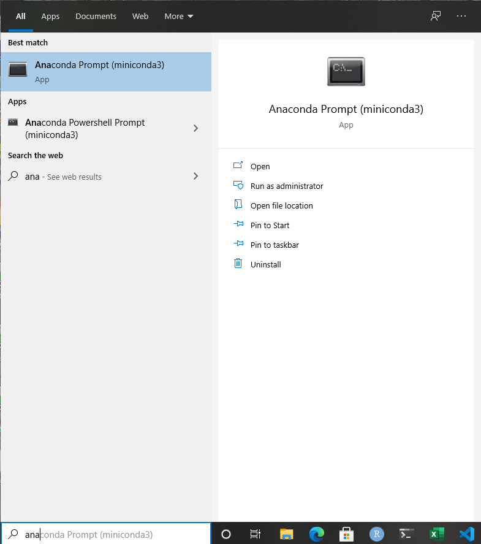

# IDMA Part time Content Repository

This repo contains the content for IDMA part time program. The repo will remain a work in progress.

## Python Essentials (Agenda, Pre-requisites and readings) 

1. **Pre-requisites**

   - Install anaconda on your system. Visit [here](https://www.anaconda.com/products/individual) to download the software.

   - After installation you should be able to see `anaconda prompt` in your search bar 

   - Revise basic ideas of programming such as variables, loops, conditionals.

2. **Readings** (Some resources require Orielly Credentials)

    **Pre-reads**

   - Python 101: [Mark Lutz, Learning Python, 5th Edition, Chapter 4](https://learning.oreilly.com/library/view/learning-python-5th/9781449355722/ch04.html#introducing_python_object_types)
   
   - **Learning Objectives:** Develop a basic familiarity with basic python datastructures, understand how to get help in a python interpretor.

   - Oops for DS:[Mark Lutz, Learning Python, 5th Edition, Chapter 26](https://learning.oreilly.com/library/view/learning-python-5th/9781449355722/ch26.html#oop_colon_the_big_picture)

   - **Learning Objectives:** Understand the idea of classes, objects and inheritance.

   - Pandas 101:[Matt Harisson, Pandas 1.x Cookbook, Chapter1](https://learning.oreilly.com/library/view/pandas-1x-cookbook/9781839213106/Text/Chapter_1.xhtml#_idParaDest-11)
   - **Learning Objectives:** Develop familiarity with dataframe and series objects in pandas, develop comfort in working with chaining of operations. 
    
    **Post Session Reads**
    - Python 101 [Mark Lutz, Learning Python, 5th Edition, Chapter 10, 13, 14](https://learning.oreilly.com/library/view/learning-python-5th/9781449355722/)

    - **Learning Objectives:** Be able to write for loops using list comprehension and zip constructs. Be confident in using conditionals and loops in python.

    - Oops for DS: [Mark Lutz, Learning Python, 5th Edition, Chapter 27](https://learning.oreilly.com/library/view/learning-python-5th/9781449355722/ch27.html#class_coding_basics). You can skim through the portion on operator overloading.

    - **Learning Objectives:** Be able to write a python class, impliment inheritance and use double dunder methods.

    - Pandas 101: [Matt Harisson, Pandas 1.x Cookbook, Chapter2, Chapter3, Chapter4, Chapter5, Chapter6, Chapter7, Chapter9](https://learning.oreilly.com/library/view/pandas-1x-cookbook/9781839213106/) You can complete these readings over a span of 2-3 weeks. As the course progresses you will find yourself using this book as a quick reference.

    - **Learning Objectives:** Be able to decide how to reduce memory footprint by changing datatypes of columns. Be aware of different data import/export mehods in pandas. Understand the need for index alignment and be able change indices to align them properly.

    ## ML Unit 2:
    - Lecture5: Regression
    - Lecture6: Non linear classification
    - Lecture7: Collaborative Filtering

    ## ML Unit 3:
    - Lecture8: Introduction to Neural Networks
    - Lecture9: Feed forward neural networks, backpropagation and stochastic gradient descent

 